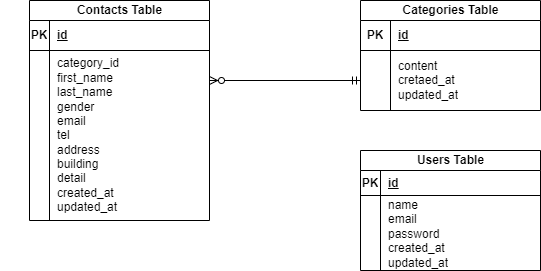

## アプリケーション名

お問い合わせフォーム
hm-kadai1

## 環境構築

Docker ビルド

1. git clone git@github.com:hmgit-git/hm-kadai1.git
2. docker-compose up -d --build

## Laravel 環境構築

1. docker-compose exec php bash
2. composer install
3. env.example ファイルから.env を作成し、環境変数を変更
4. php artisan key:generate
5. php artisan migrate
6. php artisan db:seed

## 使用技術

1. PHP 8.0
2. Laravel 10.0
3. MySQL 8.0

## URL

・開発環境：http://localhost/
・phpMyAdmin：http//localhost.8080/

## ER 図

